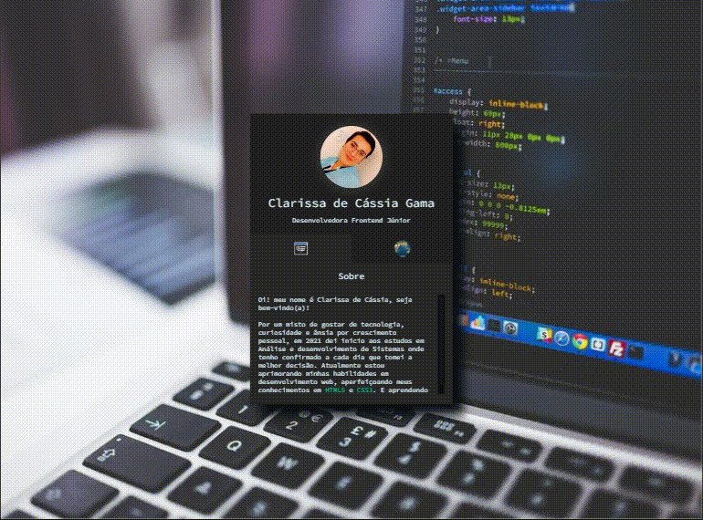

# Mini-portifólio

## Sumário

  - [Sobre o projeto](#sobreoprojeto)
  - [Layout](#layout)
  - [Tecnologias utilizadas](#tecnologias-utilizadas)
  - [O que eu aprendi](#o-que-eu-aprendi)
  - [Acesso a página](#acesso-a-página)

## Sobre o projeto

 Esse projeto faz parte da semana MAPADEV WEEK realizado pelo   [Dev-em-Dobro](https://www.youtube.com/c/DevemDobro "Site da DevSuperior"), onde podemos desenvolver um mini portifólio totalmente customizável onde pude colocar em prática todo o aprendizado até aqui.

 ## Layout 

 

 

## Tecnologias utilizadas

- HTML 
- CSS 
- JavaScript

## O que eu aprendi
Neste projeto, pude colocar em prática meus conhecimentos em HTML e CSS e dar inicío com um projeto simples a imersão ao JS. 

## Acesso a página

Para ver o projeto pronto [clique aqui ](https://claricassia.github.io/mini-portifolio/)

